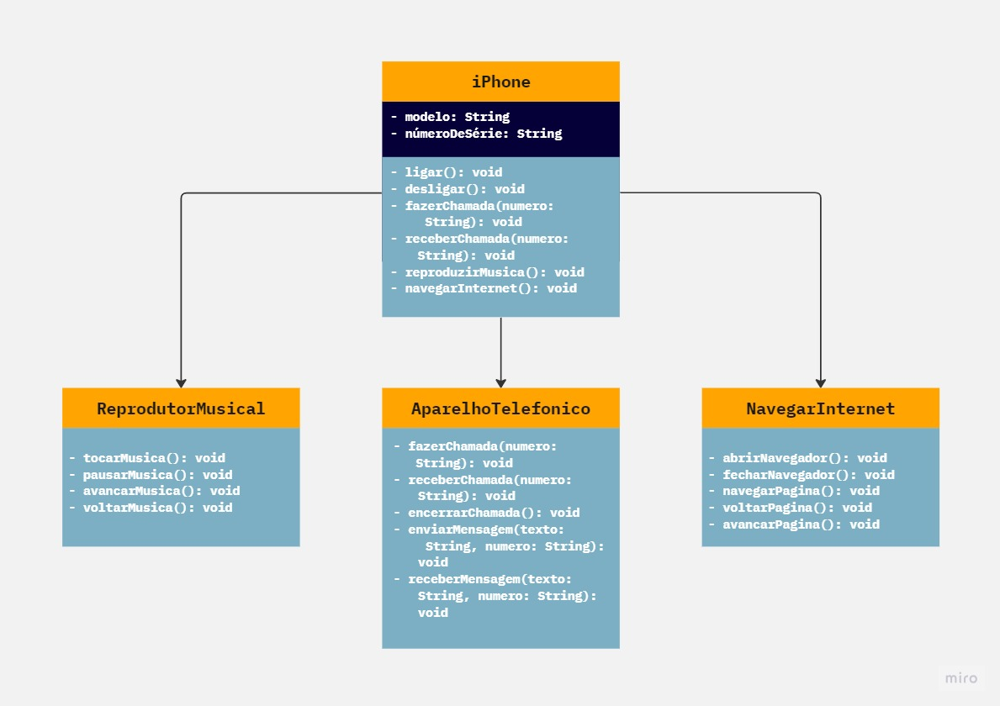

# Diagrama de classes do iPhone

Projeto de um diagrama de classes do iPhone, utilizando a Programação Orientada a Objetos com Java.

## Tópicos abordados durante esse projeto:
* Criação de um diagrama de UML
* Programação Orientada a objetos

## Tecnologias utilizadas no projeto
* Java

<h3>Contribuindo</h3>

⭐️ Star o projeto

🐛 Encontrar e relatar issues
